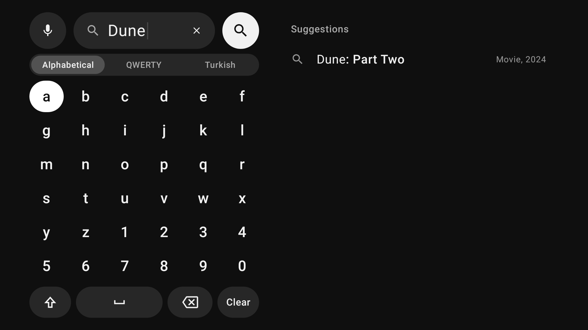
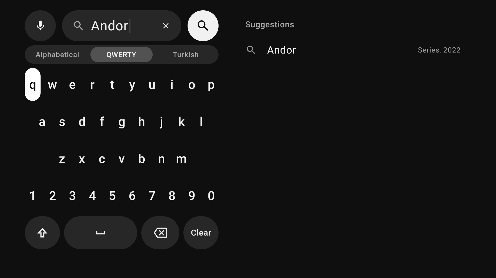
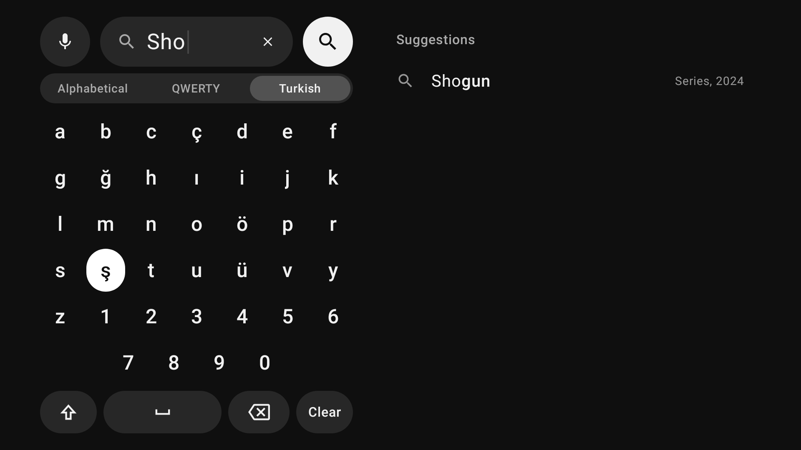
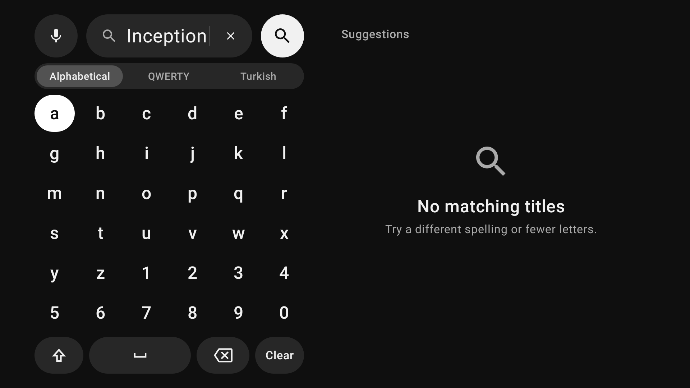

# Android TV Search Keyboard

[](https://github.com/halilozel1903/android-tv-search-keyboard/actions/workflows/ci.yml)
[](https://jitpack.io/#halilozel1903/android-tv-search-keyboard)
[](#requirements)
[](https://developer.android.com/jetpack/androidx/releases/tv)
[](LICENSE)

A production-ready, D-pad first search keyboard for Android TV, built with Jetpack Compose and TV Material 3.

The component follows the interaction model of the YouTube app on Android TV: a pill-shaped query field, a grid of bare glyphs, a white focus indicator that scales with the focused key, and a dedicated area for live suggestions. It is fully controlled, themeable, and requires no touch input.



| QWERTY | Turkish | Empty state |
| :---: | :---: | :---: |
|  |  |  |

## Features

- **10-foot design.** Large glyphs, generous spacing, and a high-contrast focus state tuned for viewing from the couch.
- **Three layouts.** Alphabetical (the YouTube order), QWERTY, and a complete Turkish alphabet, switchable from a segmented control.
- **Controlled state.** The caller owns the query, so the keyboard integrates cleanly with any ViewModel or state holder.
- **Suggestions slot.** Supply any composable to render suggestions or results next to the keys.
- **Voice search hook.** An optional microphone button that invokes your own recognizer.
- **Themeable.** Every color role and corner shape can be overridden through `TvSearchKeyboardDefaults`.
- **Accessible.** Icon-only keys expose content descriptions for screen readers.
- **Lightweight.** No dependency on the Material icons artifact. All glyphs ship as vector paths inside the library.

## Installation

The library is distributed through [JitPack](https://jitpack.io). Add the repository to `settings.gradle.kts`:

```kotlin
dependencyResolutionManagement {
    repositories {
        google()
        mavenCentral()
        maven { url = uri("https://jitpack.io") }
    }
}
```

Then add the dependency to your TV module:

```kotlin
dependencies {
    implementation("com.github.halilozel1903:android-tv-search-keyboard:1.0.0")
}
```

### Requirements

| Requirement | Version |
| --- | --- |
| `minSdk` | 23 |
| Jetpack Compose BOM | `2026.09.00` or newer |
| `androidx.tv:tv-material` | `1.1.0` or newer |
| JDK (to build from source) | 17 or newer |

## Quick start

```kotlin
import com.halil.ozel.TvSearchKeyboard

@Composable
fun SearchScreen(onSearch: (String) -> Unit) {
    var query by remember { mutableStateOf("") }

    TvSearchKeyboard(
        query = query,
        onQueryChange = { query = it },
        onSearch = onSearch,
        placeholder = "Search",
        onVoiceSearch = { /* launch your speech recognizer */ },
        suggestions = { Suggestions(query) },
    )
}
```

Focus starts on the first letter key. Every key press, including delete, clear, and space, is reported through `onQueryChange`, and `onSearch` receives the current query when the search button is pressed.

> [!NOTE]
> `onVoiceSearch` only renders the microphone button and invokes your callback. The library does not record audio or transcribe speech.

## API overview

| Parameter | Description |
| --- | --- |
| `query` / `onQueryChange` | Current text and its change callback. Required. |
| `onSearch` | Invoked with the current query when the search button is pressed. Required. |
| `placeholder` | Hint shown while the query is empty. |
| `layout` / `onLayoutChange` | Initial or controlled key arrangement. See [Layouts](#layouts). |
| `showLayoutSelector` | Hides the layout switcher and locks `layout` when `false`. |
| `onVoiceSearch` | Shows the microphone button when non-null. |
| `suggestions` | Optional composable rendered to the right of the keyboard. |
| `colors` / `shapes` | Visual overrides. See [Theming](#theming). |
| `searchLabel`, `spaceLabel`, `deleteLabel`, `clearLabel`, `shiftLabel`, `voiceSearchLabel` | Visible labels and accessibility descriptions, for localization. |
| `layoutLabels` | Labels for the layout switcher segments. |
| `requestInitialFocus` | Requests focus on the first letter key when the keyboard enters composition. |

The composable does not intercept the system Back key, so your navigation logic remains in control.

## Layouts

| Layout | Description |
| --- | --- |
| `Alphabetical` | Default. A–Z followed by digits in six columns, matching YouTube on Android TV. |
| `Qwerty` | Standard English typewriter rows with a digit row. |
| `Turkish` | The full Turkish alphabet in dictionary order, including Ç, Ğ, İ, Ö, Ş, and Ü. Dotted `i` / `İ` and dotless `ı` / `I` are separate keys. |

Shift latches until it is pressed again. Case mapping is locale-correct: on the Turkish layout shift maps `i` to `İ` and `ı` to `I`, while the English layouts map `i` to `I`.

To lock a single arrangement, pass `layout` together with `showLayoutSelector = false`. To persist the viewer's choice, pass both `layout` and `onLayoutChange` and write the new value back to your state.

## Theming

`TvSearchKeyboardDefaults.colors()` and `TvSearchKeyboardDefaults.shapes()` provide the neutral dark theme shown above. Override only the roles you need:

```kotlin
TvSearchKeyboard(
    query = query,
    onQueryChange = { query = it },
    onSearch = onSearch,
    colors = TvSearchKeyboardDefaults.colors(
        keyFocusedContainer = Color(0xFFFFD54F),
        keyFocusedContent = Color(0xFF1A1A1A),
        primaryContainer = Color(0xFFFFD54F),
    ),
    shapes = TvSearchKeyboardDefaults.shapes(
        key = RoundedCornerShape(12.dp),
    ),
)
```

| Role group | Controls |
| --- | --- |
| `key*` | Glyph keys in their resting and focused states. |
| `action*` | Microphone, shift, space, delete, and clear keys, plus the layout switcher track. |
| `field*`, `caret` | Query field container, text, placeholder, border, and caret. |
| `primary*` | The search button. |
| `chip*` | Layout switcher segments. |

## Sample app

The `sample` module is a complete Android TV search screen with a mock catalog, live filtering, suggestion highlighting, and an empty state. It declares a Leanback launcher intent, so it appears on the TV home screen after installation.

```bash
./gradlew :sample:installDebug
```

## Building from source

```bash
git clone https://github.com/halilozel1903/android-tv-search-keyboard.git
cd android-tv-search-keyboard
./gradlew :assembleRelease :sample:assembleDebug :test
```

| Task | Purpose |
| --- | --- |
| `:assembleRelease` | Builds the library AAR. |
| `:sample:assembleDebug` | Builds the sample TV app at `sample/build/outputs/apk/debug/sample-debug.apk`. |
| `:test` | Runs the layout and sizing unit tests. |
| `:sample:recordRoborazziDebug` | Regenerates the screenshots in `docs/images`. |

If `ANDROID_HOME` is not set, the build falls back to `~/Library/Android/sdk` or `~/Android/Sdk` when either directory exists.

## Contributing

Issues and pull requests are welcome. Please read [CONTRIBUTING.md](CONTRIBUTING.md) and the [Code of Conduct](CODE_OF_CONDUCT.md) before you open one, and record user-visible changes in [CHANGELOG.md](CHANGELOG.md).

## License

Released under the [MIT License](LICENSE).
