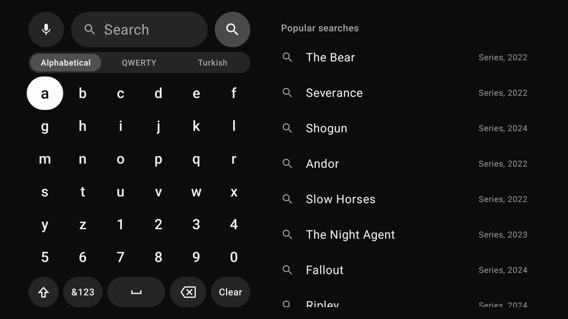
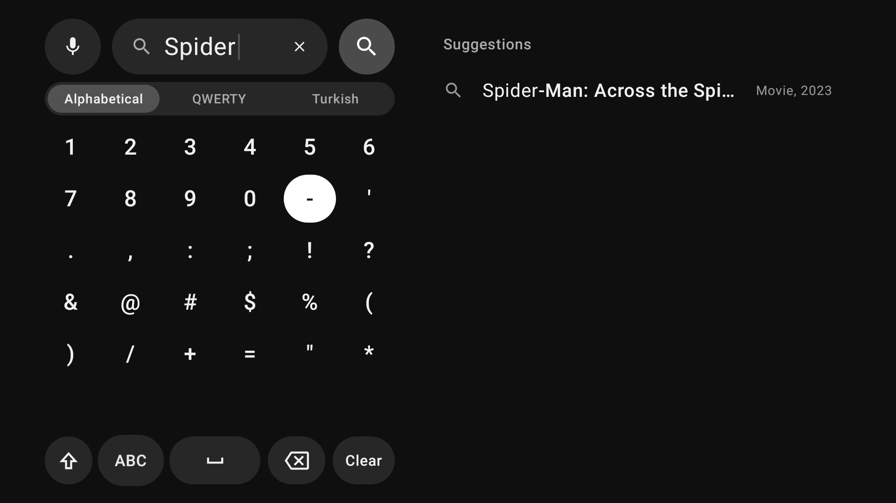
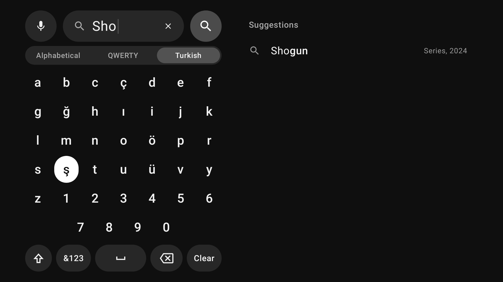
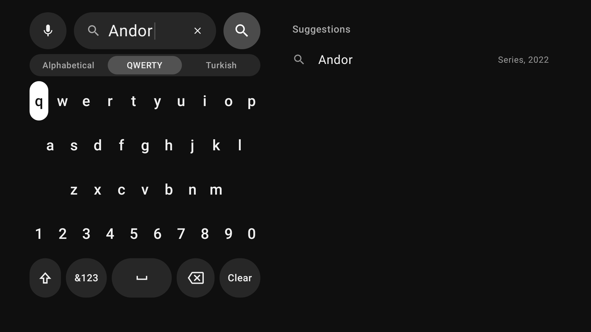
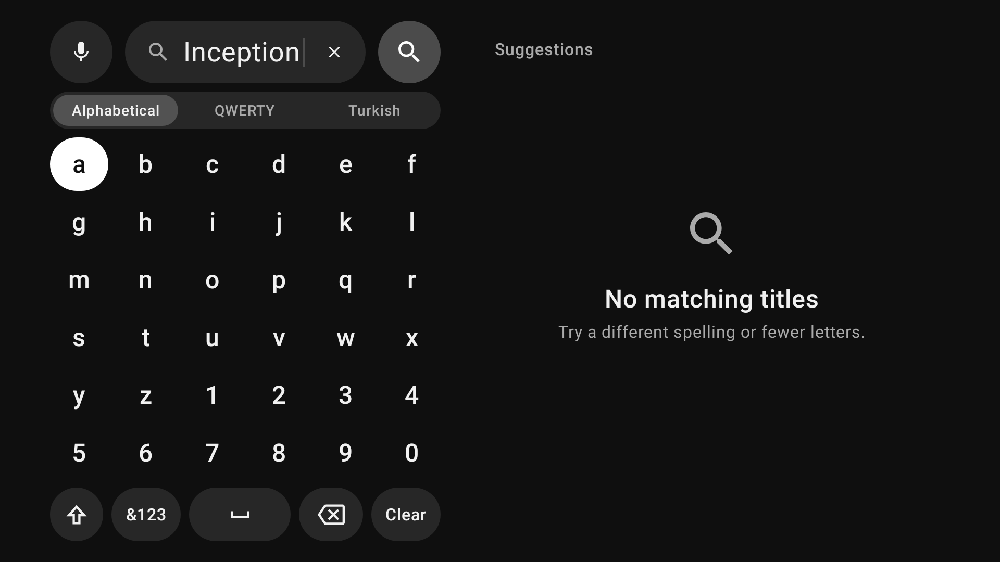

# Android TV Search Keyboard for Jetpack Compose

[](https://github.com/halilozel1903/android-tv-search-keyboard/actions/workflows/ci.yml)
[](https://jitpack.io/#halilozel1903/android-tv-search-keyboard)
[](#requirements)
[](https://developer.android.com/training/tv/playback/compose)
[](LICENSE)

**A YouTube-style on-screen search keyboard for Android TV and Google TV, built with Compose for TV.**

Compose for TV does not ship an on-screen search keyboard, and the system IME covers half of a television screen. This library fills that gap with a single composable: a D-pad driven keyboard with a query field, a suggestions area, three layouts, a symbols page, and hardware keyboard support. Add one dependency and one composable, and your search screen looks at home next to YouTube and Netflix.

<p align="center">
  
</p>

## Contents

- [Features](#features)
- [Installation](#installation)
- [Quick start](#quick-start)
- [API overview](#api-overview)
- [Layouts](#layouts)
- [Input](#input)
- [Theming](#theming)
- [Sample app](#sample-app)
- [Building from source](#building-from-source)
- [FAQ](#faq)

## Features

| | |
| --- | --- |
| 🎯 **Built for the remote** | Every key is reachable with the D-pad, focus starts on the first letter, and the focused key turns into a white pill that reads from across the room. |
| 🔤 **Three layouts** | Alphabetical (the YouTube order), QWERTY, and a complete Turkish alphabet, switched from a segmented control. |
| #️⃣ **Symbols page** | A `&123` page with digits and punctuation, so viewers can search for *Spider-Man* or *Grey's Anatomy*. |
| ⌨️ **Hardware keyboards** | USB and Bluetooth keyboards, and the number pad on many remotes, type straight into the query. |
| 💡 **Suggestions slot** | Render any composable beside the keys for live suggestions or results. |
| 🎙️ **Voice hook** | An optional microphone button that hands off to your own speech recognizer. |
| 🎨 **Themeable** | Every color role and corner shape is exposed through `TvSearchKeyboardDefaults`. |
| ♿ **Accessible** | Icon keys carry content descriptions, and every label can be localized. |
| 🪶 **Lightweight** | No Material icons artifact. All glyphs ship as vector paths inside the library. |

<table>
  <tr>
    <td align="center"><br><sub>Symbols page</sub></td>
    <td align="center"><br><sub>Turkish layout</sub></td>
  </tr>
  <tr>
    <td align="center"><br><sub>QWERTY layout</sub></td>
    <td align="center"><br><sub>Empty state in the sample</sub></td>
  </tr>
</table>

## Installation

The library is distributed through [JitPack](https://jitpack.io/#halilozel1903/android-tv-search-keyboard). Add the repository to `settings.gradle.kts`:

```kotlin
dependencyResolutionManagement {
    repositories {
        google()
        mavenCentral()
        maven { url = uri("https://jitpack.io") }
    }
}
```

Then add the dependency to your TV module:

```kotlin
dependencies {
    implementation("com.github.halilozel1903:android-tv-search-keyboard:1.1.0")
}
```

<details>
<summary>Version catalog</summary>

```toml
[versions]
tvSearchKeyboard = "1.1.0"

[libraries]
tv-search-keyboard = { module = "com.github.halilozel1903:android-tv-search-keyboard", version.ref = "tvSearchKeyboard" }
```

</details>

### Requirements

| Requirement | Version |
| --- | --- |
| `minSdk` | 23 |
| Jetpack Compose BOM | `2026.09.00` or newer |
| `androidx.tv:tv-material` | `1.1.0` or newer |
| JDK (to build from source) | 17 or newer |

## Quick start

```kotlin
import com.halil.ozel.TvSearchKeyboard

@Composable
fun SearchScreen(onSearch: (String) -> Unit) {
    var query by remember { mutableStateOf("") }

    TvSearchKeyboard(
        query = query,
        onQueryChange = { query = it },
        onSearch = onSearch,
        placeholder = "Search",
        onVoiceSearch = { /* launch your speech recognizer */ },
        suggestions = { Suggestions(query) },
    )
}
```

The keyboard is fully controlled: every key press, including delete, clear, and space, is reported through `onQueryChange`, and `onSearch` receives the current query when the viewer presses the search button. Keep the query in a `ViewModel` if you want it to survive configuration changes.

> [!NOTE]
> `onVoiceSearch` only renders the microphone button and invokes your callback. The library does not record audio or transcribe speech.

## API overview

| Parameter | Description |
| --- | --- |
| `query` / `onQueryChange` | Current text and its change callback. Required. |
| `onSearch` | Invoked with the current query when the search button is pressed. Required. |
| `placeholder` | Hint shown while the query is empty. |
| `layout` / `onLayoutChange` | Initial or controlled key arrangement. See [Layouts](#layouts). |
| `showLayoutSelector` | Hides the layout switcher and locks `layout` when `false`. |
| `onVoiceSearch` | Shows the microphone button when non-null. |
| `suggestions` | Optional composable rendered to the right of the keyboard. |
| `acceptHardwareKeyboard` | Lets physical keyboards and remote number pads edit the query. Defaults to `true`. |
| `requestInitialFocus` | Requests focus on the first letter key when the keyboard enters composition. |
| `colors` / `shapes` | Visual overrides. See [Theming](#theming). |
| `searchLabel`, `spaceLabel`, `deleteLabel`, `clearLabel`, `shiftLabel`, `voiceSearchLabel`, `symbolsLabel`, `lettersLabel` | Visible labels and accessibility descriptions, for localization. |
| `layoutLabels` | Labels for the layout switcher segments. |

The composable does not intercept the system Back key, so your navigation logic stays in control.

## Layouts

| Layout | Description |
| --- | --- |
| `Alphabetical` | Default. A–Z followed by digits in six columns, matching YouTube on Android TV. |
| `Qwerty` | Standard English typewriter rows with a digit row. |
| `Turkish` | The full Turkish alphabet in dictionary order, including Ç, Ğ, İ, Ö, Ş, and Ü. Dotted `i` / `İ` and dotless `ı` / `I` are separate keys. |

Shift latches until it is pressed again. Case mapping is locale-correct: on the Turkish layout shift maps `i` to `İ` and `ı` to `I`, while the English layouts map `i` to `I`.

The `&123` key swaps any layout for digits and punctuation, wrapped to the same number of columns so the grid keeps its shape. `ABC` switches back.

To lock a single arrangement, pass `layout` together with `showLayoutSelector = false`. To persist the viewer's choice, pass both `layout` and `onLayoutChange` and write the new value back to your state.

## Input

| Input | Result |
| --- | --- |
| D-pad and center / OK | Moves focus and presses the focused key. |
| Long press on Delete | Clears the whole query. |
| Hardware keyboard or remote number pad | Printable keys are typed into the query and Backspace deletes one character, while focus is inside the keyboard. |

Edits are applied to the latest text even when key events arrive faster than your screen recomposes, so fast typists on a Bluetooth keyboard never lose characters.

## Theming

`TvSearchKeyboardDefaults.colors()` and `TvSearchKeyboardDefaults.shapes()` provide the neutral dark theme shown above. Override only the roles you need:

```kotlin
TvSearchKeyboard(
    query = query,
    onQueryChange = { query = it },
    onSearch = onSearch,
    colors = TvSearchKeyboardDefaults.colors(
        keyFocusedContainer = Color(0xFFFFD54F),
        keyFocusedContent = Color(0xFF1A1A1A),
        primaryFocusedContainer = Color(0xFFFFD54F),
    ),
    shapes = TvSearchKeyboardDefaults.shapes(
        key = RoundedCornerShape(12.dp),
    ),
)
```

| Role group | Controls |
| --- | --- |
| `key*` | Glyph keys in their resting and focused states. The focused colors are shared by every key except search. |
| `action*` | Microphone, shift, `&123`, space, delete, and clear keys, plus the layout switcher track. |
| `field*`, `caret` | Query field container, text, placeholder, border, and caret. |
| `primary*` | The search button. |
| `chip*` | Layout switcher segments. |

## Sample app

The `sample` module is a complete Android TV search screen with a mock catalog, live filtering, YouTube-style suggestion highlighting, and an empty state. It declares a Leanback launcher intent, so it appears on the TV home screen after installation.

```bash
./gradlew :sample:installDebug
```

## Building from source

```bash
git clone https://github.com/halilozel1903/android-tv-search-keyboard.git
cd android-tv-search-keyboard
./gradlew :assembleRelease :sample:assembleDebug :test
```

| Task | Purpose |
| --- | --- |
| `:assembleRelease` | Builds the library AAR. |
| `:sample:assembleDebug` | Builds the sample TV app at `sample/build/outputs/apk/debug/sample-debug.apk`. |
| `:test` | Runs the layout, input, and sizing unit tests. |
| `:sample:testDebugUnitTest` | Runs the Robolectric UI tests on JDK 17. |
| `:sample:recordRoborazziDebug` | Regenerates the screenshots in `docs/images`. |

If `ANDROID_HOME` is not set, the build falls back to `~/Library/Android/sdk` or `~/Android/Sdk` when either directory exists.

## FAQ

**Why not use the system keyboard?**
On Android TV the system IME opens over your UI, hides suggestions, and differs between devices. An in-app keyboard keeps the layout, focus behavior, and suggestions under your control, which is why YouTube and Netflix ship their own.

**Does it work with the Leanback library?**
The keyboard is a Compose component. Host it in a `ComposeView` inside a Leanback fragment, or use it directly in a Compose for TV app.

**Can I add my own language?**
Layouts are defined in [`TvKeyboardLayouts.kt`](src/main/kotlin/com/halil/ozel/TvKeyboardLayouts.kt). Open an issue or a pull request with the alphabet and its case mapping.

## Contributing

Issues and pull requests are welcome. Please read [CONTRIBUTING.md](CONTRIBUTING.md) and the [Code of Conduct](CODE_OF_CONDUCT.md) before you open one, and record user-visible changes in [CHANGELOG.md](CHANGELOG.md).

If this library saves you time, a ⭐ on GitHub helps other TV developers find it.

## License

Released under the [MIT License](LICENSE).
